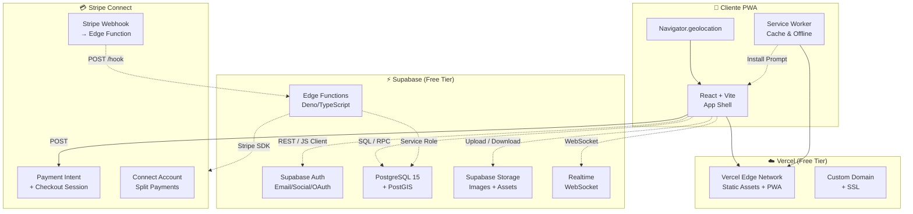
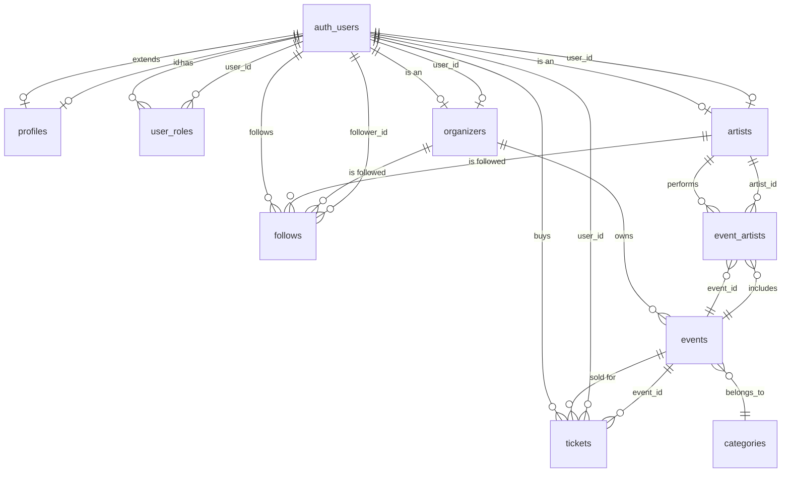

# RedSocial-Eventos — Arquitectura del Sistema

> **Versión:** 1.0.0  
> **Fecha:** Julio 2026  
> **Presupuesto:** 0 €  
> **Stack:** Supabase (Free Tier) + Vercel + Stripe Connect  

---

## Índice

1. [Diagrama de Arquitectura](#1-diagrama-de-arquitectura)
2. [Stack Tecnológico Detallado](#2-stack-tecnológico-detallado)
3. [Flujo de Datos](#3-flujo-de-datos)
4. [Diccionario de Datos](#4-diccionario-de-datos)
5. [Especificación de API / RPC](#5-especificación-de-api--rpc)
6. [Políticas RLS](#6-políticas-rls)
7. [Guía de Despliegue Paso a Paso](#7-guía-de-despliegue-paso-a-paso)

---

## 1. Diagrama de Arquitectura



### Flujo de Compra de Entradas (Secuencia)

```mermaid
sequenceDiagram
    participant U as Usuario PWA
    participant S as Supabase
    participant E as Edge Function
    participant St as Stripe
    participant DB as PostgreSQL

    U->>S: 1. Auth (JWT)
    S-->>U: 2. access_token
    U->>E: 3. POST /create-checkout {event_id, quantity}
    E->>DB: 4. BEGIN; SELECT reserve_capacity(event_id, quantity)
    DB-->>E: 5. ok / error (aforo completo)
    E->>St: 6. stripe.checkout.sessions.create(...)
    St-->>E: 7. session_id + url
    E-->>U: 8. {url, session_id}
    U->>St: 9. Redirect → Checkout Stripe
    St-->>U: 10. Pago completado
    St->>E: 11. Webhook: checkout.session.completed
    E->>DB: 12. INSERT ticket; UPDATE capacity
    E-->>U: 13. Email + QR generado
```

---

## 2. Stack Tecnológico Detallado

| Capa | Tecnología | Versión | Coste | Justificación |
|------|-----------|---------|-------|---------------|
| **Frontend** | React + Vite | React 19 / Vite 6 | 0 € | Bundle pequeño, HMR rápido, ideal para PWA |
| **PWA** | vite-plugin-pwa | Última | 0 € | Service Worker + Manifest auto-generados |
| **Estilos** | Tailwind CSS v4 | Última | 0 € | Utility-first, build minimal |
| **Despliegue** | Vercel (Hobby) | - | 0 € | Deploy automático desde GitHub, SSL gratis |
| **Backend** | Supabase (Free) | - | 0 € | PostgreSQL, Auth, Storage, Edge Functions, Realtime |
| **BD Espacial** | PostgreSQL + PostGIS | 15 + 3.4 | 0 € | Geolocalización nativa con índices GIST |
| **Auth** | Supabase Auth | - | 0 € | Email/Password, Google, GitHub, Apple |
| **Pagos** | Stripe Connect | - | 0 € | Solo se paga por transacción (comisión por venta) |
| **QR** | qrcode.js + Supabase | - | 0 € | Generación lado cliente, almacenamiento en BD |
| **ORM/Cliente** | @supabase/supabase-js | Última | 0 € | Cliente oficial, soporte RLS nativo |

### Límites del Plan Gratuito de Supabase

| Recurso | Límite |
|---------|--------|
| Filas en BD | 100.000 filas |
| Base de datos | 500 MB |
| Auth (MAU) | 50.000 usuarios/mes |
| Storage | 1 GB |
| Edge Functions | 2 GB de ancho de banda |
| Ancho de banda | 5 GB/mes |

---

## 3. Flujo de Datos

### 3.1 Autenticación
1. Usuario se registra/login desde la PWA
2. Supabase Auth devuelve JWT (access_token + refresh_token)
3. El JWT se envía en cada petición como `Authorization: Bearer <token>`
4. RLS verifica el JWT y aplica políticas por rol

### 3.2 Búsqueda Geolocalizada
1. PWA obtiene coordenadas con `navigator.geolocation.getCurrentPosition()`
2. Llama a `supabase.rpc('find_events_nearby', { lat, lng, radius_km })`
3. Postgres ejecuta la consulta espacial con índice GIST
4. Devuelve eventos ordenados por distancia

### 3.3 Compra de Entradas (Transacción Segura)
1. Cliente solicita `POST /functions/v1/create-checkout`
2. Edge Function verifica disponibilidad con `SELECT reserve_capacity(...)` (usa `SELECT ... FOR UPDATE` para evitar race conditions)
3. Crea Stripe Checkout Session
4. Usuario completa pago en Stripe
5. Webhook `checkout.session.completed` → Edge Function confirma la compra
6. Se genera QR único con UUID + event_id + user_id (hash)
7. Se actualiza aforo de forma atómica

### 3.4 Feed Social
1. Se almacenan los follows en tabla pivote
2. RPC `get_feed` hace JOIN entre follows, events y artists/organizers
3. Devuelve eventos futuros de las cuentas seguidas, ordenados por fecha

---

## 4. Diccionario de Datos

### 4.1 Enumeraciones

#### `user_role`
| Valor | Descripción |
|-------|-------------|
| `user` | Usuario final que descubre eventos y compra entradas |
| `artist` | Artista/creador que gestiona su perfil e itinerario |
| `organizer` | Organizador (empresa, ayuntamiento) que crea eventos |
| `admin` | Administrador de la plataforma |

#### `event_status`
| Valor | Descripción |
|-------|-------------|
| `draft` | Borrador, visible solo para el organizador |
| `published` | Publicado, visible para todos |
| `cancelled` | Cancelado |
| `completed` | Finalizado |

#### `ticket_status`
| Valor | Descripción |
|-------|-------------|
| `pending` | Pendiente de pago |
| `confirmed` | Pagado y confirmado |
| `cancelled` | Cancelado |
| `refunded` | Reembolsado |

#### `organizer_type`
| Valor | Descripción |
|-------|-------------|
| `company` | Empresa privada |
| `municipality` | Ayuntamiento / entidad pública |
| `association` | Asociación cultural / sin ánimo de lucro |

---

### 4.2 Tablas

#### `profiles`
Extiende la tabla `auth.users` de Supabase. Se crea automáticamente mediante un trigger tras el registro.

| Columna | Tipo | Restricciones | Descripción |
|---------|------|---------------|-------------|
| `id` | `UUID` | PK, FK → `auth.users(id)` ON DELETE CASCADE | Mismo ID que auth.users |
| `display_name` | `TEXT` | | Nombre visible en la plataforma |
| `avatar_url` | `TEXT` | | URL del avatar en Supabase Storage |
| `phone` | `TEXT` | | Teléfono de contacto |
| `location` | `GEOGRAPHY(POINT, 4326)` | | Ubicación del usuario (PostGIS) |
| `created_at` | `TIMESTAMPTZ` | `NOT NULL DEFAULT NOW()` | |
| `updated_at` | `TIMESTAMPTZ` | `NOT NULL DEFAULT NOW()` | |

**RLS:**
- `SELECT`: Todos los usuarios autenticados pueden leer perfiles
- `INSERT`: Trigger automático (solo el trigger de auth)
- `UPDATE`: El propietario del perfil o un admin
- `DELETE`: Solo admin

---

#### `user_roles`
Asigna roles a los usuarios. Un usuario puede tener múltiples roles (ej. artista y organizador).

| Columna | Tipo | Restricciones | Descripción |
|---------|------|---------------|-------------|
| `id` | `UUID` | PK, `DEFAULT gen_random_uuid()` | |
| `user_id` | `UUID` | FK → `auth.users(id)` ON DELETE CASCADE | |
| `role` | `user_role` | `NOT NULL` | Rol asignado |
| `created_at` | `TIMESTAMPTZ` | `NOT NULL DEFAULT NOW()` | |

**Índice único:** `(user_id, role)` — un usuario no puede tener el mismo rol dos veces.

**RLS:**
- `SELECT`: Autenticados (para verificar su propio rol)
- `INSERT`: Solo servidor (Edge Function) o admin
- `DELETE`: Solo admin

---

#### `artists`
Perfil extendido para usuarios con rol `artist`.

| Columna | Tipo | Restricciones | Descripción |
|---------|------|---------------|-------------|
| `id` | `UUID` | PK, `DEFAULT gen_random_uuid()` | |
| `user_id` | `UUID` | FK → `auth.users(id)` ON DELETE CASCADE, `UNIQUE` | |
| `stage_name` | `TEXT` | `NOT NULL` | Nombre artístico |
| `bio` | `TEXT` | | Biografía |
| `genre` | `TEXT[]` | | Array de géneros musicales (ej. `{'Rock', 'Jazz'}`) |
| `social_links` | `JSONB` | | `{"instagram": "...", "youtube": "...", "spotify": "..."}` |
| `website` | `TEXT` | | Sitio web |
| `is_verified` | `BOOLEAN` | `DEFAULT FALSE` | Verificado por el admin |
| `created_at` | `TIMESTAMPTZ` | `NOT NULL DEFAULT NOW()` | |
| `updated_at` | `TIMESTAMPTZ` | `NOT NULL DEFAULT NOW()` | |

**RLS:**
- `SELECT`: Público (usuarios no autenticados incluidos)
- `INSERT`: Usuario con rol `artist` (solo su propio perfil)
- `UPDATE`: El propio artista o un admin
- `DELETE`: Solo admin

---

#### `organizers`
Perfil extendido para usuarios con rol `organizer`. Requiere aprobación del admin.

| Columna | Tipo | Restricciones | Descripción |
|---------|------|---------------|-------------|
| `id` | `UUID` | PK, `DEFAULT gen_random_uuid()` | |
| `user_id` | `UUID` | FK → `auth.users(id)` ON DELETE CASCADE, `UNIQUE` | |
| `org_name` | `TEXT` | `NOT NULL` | Nombre de la organización |
| `org_type` | `organizer_type` | `NOT NULL` | Tipo de organización |
| `description` | `TEXT` | | Descripción |
| `address` | `TEXT` | | Dirección física |
| `website` | `TEXT` | | Sitio web |
| `tax_id` | `TEXT` | | CIF / NIF |
| `is_approved` | `BOOLEAN` | `NOT NULL DEFAULT FALSE` | Aprobado por el admin |
| `stripe_account_id` | `TEXT` | | ID de cuenta Stripe Connect |
| `created_at` | `TIMESTAMPTZ` | `NOT NULL DEFAULT NOW()` | |
| `updated_at` | `TIMESTAMPTZ` | `NOT NULL DEFAULT NOW()` | |

**RLS:**
- `SELECT`: Público (solo organizadores aprobados)
- `INSERT`: Usuario con rol `organizer` (solo su propio perfil)
- `UPDATE`: El propio organizador o un admin
- `DELETE`: Solo admin

---

#### `categories`
Taxonomía de eventos.

| Columna | Tipo | Restricciones | Descripción |
|---------|------|---------------|-------------|
| `id` | `UUID` | PK, `DEFAULT gen_random_uuid()` | |
| `name` | `TEXT` | `NOT NULL UNIQUE` | Nombre (ej. "Concierto", "Teatro") |
| `slug` | `TEXT` | `NOT NULL UNIQUE` | Slug URL (ej. "concierto") |
| `icon` | `TEXT` | | Icono (nombre de Lucide o similar) |
| `color` | `TEXT` | | Color hexadecimal para la UI |

**RLS:** Público (todo el mundo puede leer), solo admin puede insertar/actualizar/eliminar.

---

#### `events`
Tabla principal. Cada fila es un evento creado por un organizador.

| Columna | Tipo | Restricciones | Descripción |
|---------|------|---------------|-------------|
| `id` | `UUID` | PK, `DEFAULT gen_random_uuid()` | |
| `organizer_id` | `UUID` | FK → `organizers(id)` ON DELETE CASCADE | Organizador responsable |
| `title` | `TEXT` | `NOT NULL` | Título del evento |
| `description` | `TEXT` | | Descripción completa (markdown) |
| `short_description` | `TEXT` | | Resumen breve para tarjetas |
| `cover_image_url` | `TEXT` | | URL del cartel en Supabase Storage |
| `category_id` | `UUID` | FK → `categories(id)` | Categoría del evento |
| `location` | `GEOGRAPHY(POINT, 4326)` | `NOT NULL` | Coordenadas GPS (PostGIS) |
| `address` | `TEXT` | `NOT NULL` | Dirección del evento |
| `city` | `TEXT` | `NOT NULL` | Ciudad |
| `province` | `TEXT` | | Provincia |
| `country` | `TEXT` | `NOT NULL DEFAULT 'España'` | País |
| `start_date` | `TIMESTAMPTZ` | `NOT NULL` | Fecha/hora de inicio |
| `end_date` | `TIMESTAMPTZ` | `NOT NULL` | Fecha/hora de fin |
| `status` | `event_status` | `NOT NULL DEFAULT 'draft'` | Estado del evento |
| `max_capacity` | `INTEGER` | `NOT NULL CHECK (max_capacity > 0)` | Aforo máximo |
| `remaining_capacity` | `INTEGER` | `NOT NULL CHECK (remaining_capacity >= 0)` | Aforo restante |
| `is_free` | `BOOLEAN` | `NOT NULL DEFAULT TRUE` | ¿Es gratuito? |
| `price` | `DECIMAL(10,2)` | `CHECK (price >= 0)` | Precio por entrada (si no es gratis) |
| `currency` | `TEXT` | `DEFAULT 'EUR'` | Moneda |
| `stripe_price_id` | `TEXT` | | ID del precio en Stripe |
| `tags` | `TEXT[]` | | Etiquetas para búsqueda |
| `created_at` | `TIMESTAMPTZ` | `NOT NULL DEFAULT NOW()` | |
| `updated_at` | `TIMESTAMPTZ` | `NOT NULL DEFAULT NOW()` | |

**Restricciones adicionales:**
- `CHECK (end_date > start_date)`
- `CHECK (is_free = TRUE OR price IS NOT NULL)`

**Índices:**
- `GIST("location")` — índice espacial para búsquedas por radio
- `BTREE(start_date)` — ordenación por fecha
- `BTREE(status)` — filtrado por estado
- `BTREE(city)` — búsqueda por ciudad

**RLS:**
- `SELECT`: Eventos con estado `published` o `completed` son públicos; `draft` solo visible para el organizador y admin
- `INSERT`: Organizador autenticado (solo sus propios eventos)
- `UPDATE`: Organizador propietario o admin
- `DELETE`: Organizador propietario o admin

---

#### `event_artists`
Relación muchos-a-muchos entre eventos y artistas.

| Columna | Tipo | Restricciones | Descripción |
|---------|------|---------------|-------------|
| `id` | `UUID` | PK, `DEFAULT gen_random_uuid()` | |
| `event_id` | `UUID` | FK → `events(id)` ON DELETE CASCADE | |
| `artist_id` | `UUID` | FK → `artists(id)` ON DELETE CASCADE | |
| `stage_time` | `TIMESTAMPTZ` | | Hora de actuación del artista |

**Índice único:** `(event_id, artist_id)`

**RLS:** Mismas políticas que `events` (se gestiona desde el organizador).

---

#### `tickets`
Entradas vendidas. Cada fila puede representar 1 o N entradas (simplificado para MVP).

| Columna | Tipo | Restricciones | Descripción |
|---------|------|---------------|-------------|
| `id` | `UUID` | PK, `DEFAULT gen_random_uuid()` | |
| `event_id` | `UUID` | FK → `events(id)` ON DELETE CASCADE | |
| `user_id` | `UUID` | FK → `auth.users(id)` ON DELETE CASCADE | Comprador |
| `quantity` | `INTEGER` | `NOT NULL CHECK (quantity > 0)` | Número de entradas |
| `unit_price` | `DECIMAL(10,2)` | `NOT NULL CHECK (unit_price >= 0)` | Precio unitario |
| `total_amount` | `DECIMAL(10,2)` | `NOT NULL CHECK (total_amount >= 0)` | Precio total |
| `status` | `ticket_status` | `NOT NULL DEFAULT 'confirmed'` | Estado |
| `stripe_session_id` | `TEXT` | | ID de sesión Stripe |
| `qr_code` | `TEXT` | `UNIQUE` | Código QR único (hash SHA-256 de UUIDs) |
| `created_at` | `TIMESTAMPTZ` | `NOT NULL DEFAULT NOW()` | |
| `updated_at` | `TIMESTAMPTZ` | `NOT NULL DEFAULT NOW()` | |

**RLS:**
- `SELECT`: El comprador, el organizador del evento, o admin
- `INSERT`: Solo mediante Edge Function (compra verificada)
- `UPDATE`: Solo admin (para refunds)

---

#### `follows`
Sistema de seguimiento social.

| Columna | Tipo | Restricciones | Descripción |
|---------|------|---------------|-------------|
| `id` | `UUID` | PK, `DEFAULT gen_random_uuid()` | |
| `follower_id` | `UUID` | FK → `auth.users(id)` ON DELETE CASCADE | Usuario que sigue |
| `following_id` | `UUID` | `NOT NULL` | ID del artista u organizador seguido |
| `following_type` | `TEXT` | `NOT NULL CHECK (following_type IN ('artist', 'organizer'))` | Tipo de cuenta seguida |
| `created_at` | `TIMESTAMPTZ` | `NOT NULL DEFAULT NOW()` | |

**Índice único:** `(follower_id, following_id, following_type)`

**RLS:**
- `SELECT`: Cualquier usuario autenticado
- `INSERT`: Usuario autenticado (solo sus propios follows)
- `DELETE`: Usuario autenticado (solo sus propios follows)

---

### 4.3 Diagrama Entidad-Relación



---

## 5. Especificación de API / RPC

### 5.1 `find_events_nearby`

Busca eventos publicados dentro de un radio en kilómetros desde un punto geográfico.

```sql
FUNCTION find_events_nearby(
    lat DOUBLE PRECISION,
    lng DOUBLE PRECISION,
    radius_km DOUBLE PRECISION DEFAULT 25
)
RETURNS TABLE(
    id UUID,
    title TEXT,
    short_description TEXT,
    cover_image_url TEXT,
    city TEXT,
    province TEXT,
    start_date TIMESTAMPTZ,
    end_date TIMESTAMPTZ,
    is_free BOOLEAN,
    price DECIMAL(10,2),
    currency TEXT,
    max_capacity INTEGER,
    remaining_capacity INTEGER,
    distance_km DOUBLE PRECISION,
    organizer_name TEXT,
    category_name TEXT,
    category_slug TEXT,
    tags TEXT[]
)
```

| Parámetro | Tipo | Default | Descripción |
|-----------|------|---------|-------------|
| `lat` | `DOUBLE PRECISION` | — | Latitud del centro de búsqueda |
| `lng` | `DOUBLE PRECISION` | — | Longitud del centro de búsqueda |
| `radius_km` | `DOUBLE PRECISION` | `25` | Radio de búsqueda en km |

**Formato respuesta:** Array JSON de eventos, cada uno con los campos del `RETURNS TABLE`. Ordenados por `distance_km` ascendente.

**Códigos de error:**
| Código | Mensaje | Causa |
|--------|---------|-------|
| `P0001` | `invalid latitude value` | `lat` fuera de rango [-90, 90] |
| `P0001` | `invalid longitude value` | `lng` fuera de rango [-180, 180] |
| `P0001` | `radius must be positive` | `radius_km <= 0` |

---

### 5.2 `get_feed`

Obtiene el feed de eventos de los artistas y organizadores que el usuario sigue.

```sql
FUNCTION get_feed(
    p_user_id UUID
)
RETURNS TABLE(
    id UUID,
    title TEXT,
    short_description TEXT,
    cover_image_url TEXT,
    city TEXT,
    start_date TIMESTAMPTZ,
    is_free BOOLEAN,
    price DECIMAL(10,2),
    organizer_name TEXT,
    organizer_id UUID,
    category_slug TEXT,
    tags TEXT[],
    distance_km DOUBLE PRECISION
)
```

| Parámetro | Tipo | Default | Descripción |
|-----------|------|---------|-------------|
| `p_user_id` | `UUID` | — | ID del usuario para obtener su feed |

**Formato respuesta:** Array JSON de eventos publicados/futuros. Ordenados por `start_date` ascendente.

**Códigos de error:**
| Código | Mensaje | Causa |
|--------|---------|-------|
| `P0001` | `user_id is required` | `p_user_id` es NULL |
| `P0001` | `user not found` | El UUID no existe en `auth.users` |

---

### 5.3 `reserve_capacity`

Reserva capacidad de un evento de forma atómica (usado dentro de la transacción de compra).

```sql
FUNCTION reserve_capacity(
    p_event_id UUID,
    p_quantity INTEGER
)
RETURNS BOOLEAN
```

| Parámetro | Tipo | Default | Descripción |
|-----------|------|---------|-------------|
| `p_event_id` | `UUID` | — | ID del evento |
| `p_quantity` | `INTEGER` | — | Número de entradas a reservar |

**Lógica:**
1. Bloquea la fila del evento con `SELECT ... FOR UPDATE`
2. Verifica que `remaining_capacity >= p_quantity`
3. Si hay suficiente: resta `p_quantity` de `remaining_capacity` y devuelve `TRUE`
4. Si no: devuelve `FALSE`

**Códigos de error:**
| Código | Mensaje | Causa |
|--------|---------|-------|
| `P0001` | `insufficient capacity` | No hay aforo suficiente |
| `P0001` | `event is not published` | El evento no está en estado `published` |
| `P0001` | `quantity must be positive` | `p_quantity <= 0` |

---

### 5.4 `confirm_ticket`

Confirma la compra tras el pago exitoso en Stripe (webhook).

```sql
FUNCTION confirm_ticket(
    p_event_id UUID,
    p_user_id UUID,
    p_quantity INTEGER,
    p_unit_price DECIMAL,
    p_total_amount DECIMAL,
    p_stripe_session_id TEXT
)
RETURNS UUID  -- ID del ticket creado
```

| Parámetro | Tipo | Descripción |
|-----------|------|-------------|
| `p_event_id` | `UUID` | ID del evento |
| `p_user_id` | `UUID` | ID del comprador |
| `p_quantity` | `INTEGER` | Número de entradas |
| `p_unit_price` | `DECIMAL` | Precio unitario |
| `p_total_amount` | `DECIMAL` | Monto total |
| `p_stripe_session_id` | `TEXT` | ID de sesión de Stripe |

**Lógica:**
1. Verifica que la sesión de Stripe no se haya usado antes
2. Genera un QR único: `SHA-256(CONCAT(p_event_id, p_user_id, gen_random_uuid()))`
3. Inserta el ticket
4. Devuelve el UUID del ticket creado

**Códigos de error:**
| Código | Mensaje | Causa |
|--------|---------|-------|
| `P0001` | `duplicate stripe session` | `p_stripe_session_id` ya existe en tickets |
| `P0001` | `event not found` | `p_event_id` no existe |
| `P0001` | `user not found` | `p_user_id` no existe en auth.users |

---

### 5.5 `get_artist_schedule`

Obtiene los eventos (futuros y pasados) de un artista específico.

```sql
FUNCTION get_artist_schedule(
    p_artist_id UUID
)
RETURNS TABLE(
    event_id UUID,
    title TEXT,
    cover_image_url TEXT,
    city TEXT,
    start_date TIMESTAMPTZ,
    end_date TIMESTAMPTZ,
    stage_time TIMESTAMPTZ,
    status event_status,
    organizer_name TEXT
)
```

| Parámetro | Tipo | Descripción |
|-----------|------|-------------|
| `p_artist_id` | `UUID` | ID del artista |

**Formato respuesta:** Array JSON de eventos. Eventos futuros primero (orden ascendente), pasados después.

---

### 5.6 `get_event_tickets_organizer`

Obtiene todas las entradas vendidas para un evento (solo para el organizador).

```sql
FUNCTION get_event_tickets_organizer(
    p_event_id UUID,
    p_organizer_user_id UUID
)
RETURNS TABLE(
    ticket_id UUID,
    user_id UUID,
    user_name TEXT,
    quantity INTEGER,
    total_amount DECIMAL,
    status ticket_status,
    qr_code TEXT,
    purchased_at TIMESTAMPTZ
)
```

**Seguridad:** Solo devuelve datos si `p_organizer_user_id` es el propietario del evento o es admin. Si no, lanza excepción.

---

## 6. Políticas RLS

### Resumen de Acceso por Rol

| Tabla | Anónimo | Usuario | Artista | Organizador | Admin |
|-------|---------|---------|---------|-------------|-------|
| `profiles` | — | CR (propio) + R (todos) | CR (propio) + R (todos) | CR (propio) + R (todos) | CRUD |
| `user_roles` | — | R (propio) | R (propio) | R (propio) | CRUD |
| `artists` | R | R | CRUD (propio) | R | CRUD |
| `organizers` | R (approved) | R (approved) | R (approved) | CRUD (propio) | CRUD |
| `events` | R (published) | R (published) | R (published) | CRUD (propio) | CRUD |
| `event_artists` | R (published) | R (published) | R (published) | CRUD (propio) | CRUD |
| `tickets` | — | CR (propio) | R (eventos propios) | R (eventos propios) | CRUD |
| `follows` | — | CRD (propio) + R | CRD (propio) + R | CRD (propio) + R | CRUD |
| `categories` | R | R | R | R | CRUD |

> **Leyenda:** C=Create, R=Read, U=Update, D=Delete, "propio"=solo sus propios registros

### Implementación: Estrategia de Roles en RLS

Para evitar la complejidad de múltiples tablas de roles, se usa una función auxiliar `is_admin()` y `has_role()` que consulta `user_roles`:

```sql
CREATE OR REPLACE FUNCTION public.is_admin()
RETURNS BOOLEAN
LANGUAGE sql STABLE SECURITY DEFINER
AS $$
  SELECT EXISTS (
    SELECT 1 FROM public.user_roles
    WHERE user_id = auth.uid()
      AND role = 'admin'
  );
$$;

CREATE OR REPLACE FUNCTION public.has_role(p_role user_role)
RETURNS BOOLEAN
LANGUAGE sql STABLE SECURITY DEFINER
AS $$
  SELECT EXISTS (
    SELECT 1 FROM public.user_roles
    WHERE user_id = auth.uid()
      AND role = p_role
  );
$$;
```

---

## 7. Guía de Despliegue Paso a Paso

### Prerrequisitos
- Cuenta gratuita en [Supabase](https://supabase.com)
- Cuenta gratuita en [Vercel](https://vercel.com)
- Cuenta gratuita en [Stripe](https://stripe.com)
- [GitHub](https://github.com) cuenta para el repositorio
- Node.js 20+ y Git instalados localmente

### Paso 1: Configurar Supabase

1. Ve a [supabase.com](https://supabase.com) e inicia sesión
2. Clic en **"New project"**
3. Completa:
   - **Name:** `redsocial-eventos`
   - **Database Password:** (generar o poner una segura)
   - **Region:** `West Europe` (o la más cercana a tu audiencia)
   - **Pricing Plan:** Free
4. Espera a que se aprovisione (~2 minutos)
5. Ve a **SQL Editor** y pega el contenido de `supabase/init.sql`
6. Ejecuta todo el script (creará tablas, RLS, RPCs, triggers)
7. Ve a **Authentication → Settings** y configura:
   - **Site URL:** la URL de tu Vercel (ej. `https://redsocial-eventos.vercel.app`)
   - Habilita los proveedores que quieras (Google, GitHub, etc.)
8. Ve a **Storage** y crea buckets:
   - `avatars` (público, solo imágenes)
   - `event-covers` (público, solo imágenes)

### Paso 2: Configurar Stripe Connect

1. Ve a [dashboard.stripe.com](https://dashboard.stripe.com) y crea una cuenta
2. Activa el modo **test** (para desarrollo)
3. Ve a **Connect → Settings → Onboarding**
4. Configura el tipo de plataforma (Marketplace)
5. Obtén tus claves:
   - `STRIPE_SECRET_KEY` (del dashboard)
   - `STRIPE_WEBHOOK_SECRET` (creando un endpoint)
6. Guarda estas claves para las Edge Functions

### Paso 3: Crear el Frontend Localmente

```bash
# 1. Clonar el repositorio (o crear el proyecto)
git clone <tu-repo> redsocial-eventos
cd redsocial-eventos

# 2. Crear proyecto Vite con React
npm create vite@latest . -- --template react-ts

# 3. Instalar dependencias
npm install
npm install @supabase/supabase-js @stripe/stripe-js qrcode
npm install -D tailwindcss @tailwindcss/vite vite-plugin-pwa

# 4. Configurar variables de entorno (.env)
cat > .env.local << EOF
VITE_SUPABASE_URL=https://<tu-proyecto>.supabase.co
VITE_SUPABASE_ANON_KEY=<tu-anon-key>
VITE_STRIPE_PUBLISHABLE_KEY=<tu-stripe-publishable-key>
EOF
```

### Paso 4: Desplegar en Vercel

1. Sube el código a GitHub:
   ```bash
   git init
   git add .
   git commit -m "chore: initial MVP scaffold"
   git branch -M main
   git remote add origin <tu-repo-url>
   git push -u origin main
   ```
2. Ve a [vercel.com](https://vercel.com) e importa el repositorio
3. Configura:
   - **Framework Preset:** Vite
   - **Build Command:** `npm run build`
   - **Output Directory:** `dist`
   - **Environment Variables:** añade las mismas que `.env.local`
4. Clic en **Deploy**
5. Ve a **Settings → Domain** para configurar un dominio personalizado (opcional)

### Paso 5: Configurar el Webhook de Stripe

1. En Vercel, despliega las Edge Functions de Supabase o usa Vercel Functions
2. En Stripe Dashboard → **Developers → Webhooks**
3. Añade endpoint: `https://<tu-proyecto>.supabase.co/functions/v1/stripe-webhook`
4. Suscríbete a eventos: `checkout.session.completed`, `checkout.session.expired`
5. Copia el **Signing Secret** y configúralo como variable de entorno en Supabase

### Paso 6: Verificar la Instalación

1. Abre la URL de Vercel
2. Regístrate con email o Google
3. Crea un perfil de artista u organizador
4. Crea un evento de prueba
5. Verifica que aparece en el mapa/búsqueda
6. Compra una entrada de prueba (Stripe en modo test)
7. Verifica que el QR se genera correctamente

### Costes Mensuales Estimados (MVP)

| Servicio | Coste | Notas |
|----------|-------|-------|
| Supabase Free | 0 € | Hasta 100k filas, 500 MB BD, 1 GB Storage |
| Vercel Hobby | 0 € | 100 GB ancho de banda, 6000 build hours |
| Stripe Connect | 0 € | Sin tarifa mensual, solo comisión por transacción |
| Dominio (.es) | ~5 €/año | Opcional (coste en registro) |
| **Total** | **0 €** | |

---

## Apéndice: Convenciones del Proyecto

### Nomenclatura
- **Tablas:** `snake_case` plural (ej. `user_roles`, `event_artists`)
- **Columnas:** `snake_case` (ej. `display_name`, `org_type`)
- **Funciones RPC:** `snake_case` (ej. `find_events_nearby`)
- **Archivos:** `kebab-case` (ej. `supabase/init.sql`)
- **Componentes React:** `PascalCase` (ej. `EventCard.tsx`)
- **Hooks React:** `camelCase` con prefijo `use` (ej. `useEvents`)

### Seguridad
- Nunca exponer `service_role` key en el cliente
- Usar siempre RLS para autorización
- Validar inputs en Edge Functions
- Stripe Webhooks deben verificar la firma con `stripe.webhooks.constructEvent()`
- Las funciones RPC de Postgres usan `SECURITY DEFINER` solo cuando es estrictamente necesario
